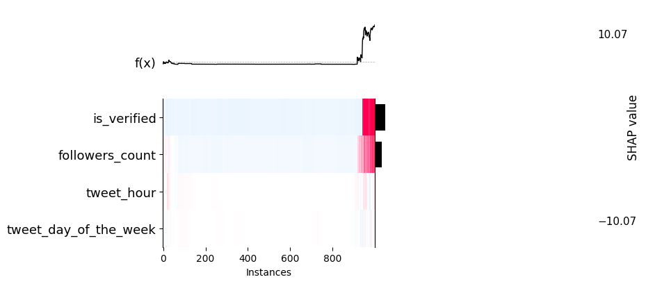
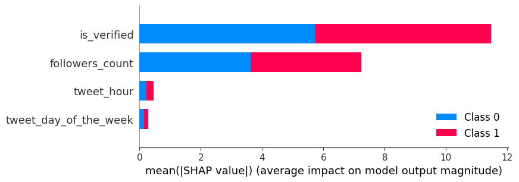

# Tweets popularity prediction

### I- Dataset Collection
* Dataset is collected __manually__ based on trends in day-to-day.
* Trends list are created dynamically, by querying the Twitter API
* Fetch Data by using fetch_data packages in script folder 

### II- Features selected for baseline

* __Features selected :__
  * tweet_quarter
  * tweet_day_of_the_week
  * tweet_hour
  * trend_volume
  * __is_verified__
  * __followers_count__

We try to keep things simple for this first version 

### III- Target : Predict viral tweet

* Predict if a tweet will be viral 
  * Model is NOT based on the tweet itself
  
* We define 3 levels of virality : 
  * number of fav < 50 => non viral tweets => mapped to 0
  * Number of fav in range(30, 500) => medium viral tweets => mapped to 1
  * Number of fav > 500 => high viral tweets => mapped to 2

### IV- __Baseline result__

Yeah the data is unbalanced and that is quite logic :) 

 ```
                precision    recall  f1-score   support

           0       1.00      0.99      1.00       541
           1       0.38      0.30      0.33        10
           2       0.69      0.78      0.73        23

    accuracy                           0.97       574
   macro avg       0.69      0.69      0.69       574
weighted avg       0.97      0.97      0.97       574

  ```
### V- Interpretability : SHAP Explainer


* __Inference__

  
* __Features importances__



